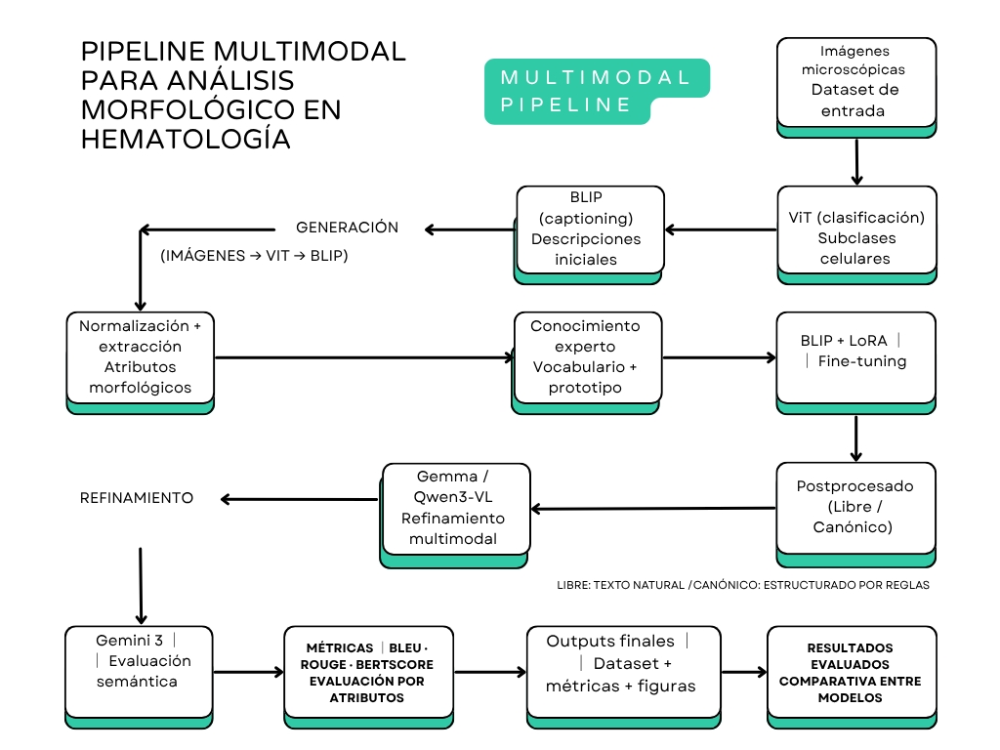

# Evaluación y fine-tuning de modelos visión-lenguaje para la mejora del análisis morfológico en hematología digital.

Repositorio asociado al Trabajo Fin de Máster centrado en la evaluación, validación y mejora de descripciones morfológicas generadas por modelos visión-lenguaje en hematología digital.
El proyecto integra técnicas de visión por computador, modelos visión-lenguaje y evaluación semántica automática para el análisis morfológico de células sanguíneas.

---

## Objetivos

- Clasificar células sanguíneas a partir de imágenes microscópicas.
- Generar descripciones morfológicas automáticas.
- Adaptar modelos de captioning al dominio hematológico.
- Evaluar la calidad descriptiva mediante auditoría semántica automática.
- Analizar el rendimiento global y por atributos morfológicos.

---

---

## Pipeline propuesto



---


## Arquitectura general

```text
Imágenes microscópicas
        │
        ▼
Clasificación celular (ViT)
        │
        ▼
Generación y refinamiento de descripciones
        │
        ▼
Evaluación semántica y análisis de concordancia
        │
        ▼
Análisis final
```

---

## Modelos utilizados

### Clasificación celular

- Vision Transformer (ViT) fine-tuned para clasificación de subtipos celulares

### Generación y refinamiento de descripciones

- BLIP
- Modelos multimodales visión-lenguaje adaptados
- Modelos de razonamiento multimodal

### Evaluación y validación

- Evaluación semántica automatizada
- Análisis de concordancia entre modelos

---

## Resultados principales

### Clasificación celular

| Métrica | Valor |
|----------|----------:|
| Accuracy | 98.50 % |
| F1 weighted | 0.985 |

### Comparativa global

| Modelo | Correcto ampliado (%) | Utilidad alta (%) | Mejora (%) | Accuracy atributos (%) |
|---|---:|---:|---:|---:|
| BLIP+LoRA libre base | 35.71 | 31.11 | 31.17 | 69.34 |
| BLIP+LoRA híbrido | 83.80 | 80.95 | 47.71 | 86.11 |
| Gemma 3 | 94.04 | 69.28 | 70.32 | 86.01 |
| Qwen3-VL | 99.74 | 74.72 | 99.74 | 48.86 |


Aunque Qwen3-VL obtuvo una elevada tasa de generación de descripciones consideradas correctas a nivel global, mostró limitaciones en la identificación explícita de atributos morfológicos específicos, lo que redujo significativamente su accuracy por atributo.

### Rendimiento por atributo morfológico

| Atributo | BLIP+LoRA libre base | BLIP+LoRA híbrido | Gemma 3 | Qwen3-VL |
|-----------|----------:|----------:|----------:|----------:|
| Clase celular | 99.35 | 97.34 | 99.48 | 99.61 |
| Tamaño celular | 94.82 | 96.04 | 92.05 | 6.04 |
| Forma nuclear | 90.25 | 91.39 | 92.49 | 57.19 |
| Cromatina | 92.65 | 97.56 | 92.99 | 50.62 |
| Citoplasma | 84.38 | 82.65 | 87.13 | 47.27 |
| Granulación | 43.94 | 51.66 | 87.34 | 32.40 |


Los resultados muestran que el rendimiento no fue homogéneo entre atributos morfológicos, observándose mayores dificultades en la identificación de la granulación y, en menor medida, del citoplasma.

---

## Resultados adicionales

El repositorio incluye figuras y análisis complementarios desarrollados durante el trabajo:

- Matriz de confusión multicategoría para clasificación celular.
- Heatmap de accuracy por atributo morfológico.
- Diagramas de concordancia entre evaluadores automáticos.
- Comparativas globales entre modelos multimodales.

---

## Estructura del repositorio

```text
blood-cell-vllm/
├── memoria
│   └── Diana_Gutierrez_TFM
├── codigo/
│   ├── blip_lora_libre_hibrido_gemma_qwen.ipynb
│   └── vit_blip_base_libre.ipynb
│
├── modelos/
│   └── blip_lora_hibrido_final/README.md
│
├── figuras/
│   ├── matriz_confusion_vit.png
│   ├── heatmap_accuracy_atributos.png
│   └── pipeline_multimodal_hematologia.png
│
└── README.md
```
...
## Datos

Determinados recursos utilizados durante el desarrollo del proyecto, incluidos los conjuntos de datos experimentales, no se distribuyen en esta versión pública del repositorio.

**Disponibilidad de datos y materiales**

Algunos de los recursos empleados durante el desarrollo, entrenamiento y evaluación de los modelos no forman parte de esta versión pública del repositorio.

Por este motivo, el material disponible representa una versión parcial del entorno experimental utilizado en el presente trabajo.

---

## Autor

**Diana Gutiérrez Martínez**

Trabajo Fin de Máster

Máster en Bioinformática y Bioestadística

Universitat Oberta de Catalunya (UOC)

18 junio 2026

---

## Director

**Edwin Santiago Alférez Baquero**

---

## Autoría y uso académico

© 2026 Diana Gutiérrez Martínez

Este repositorio contiene materiales desarrollados en el marco del Trabajo Fin de Máster *"Evaluación y fine-tuning de modelos visión-lenguaje para la mejora del análisis morfológico en hematología digital"*.

**Autora:** Diana Gutiérrez Martínez
**Dirección académica:** Dr. Edwin Santiago Alférez Baquero

Salvo indicación expresa de la autora, no se autoriza la reproducción, distribución o reutilización total o parcial del código, documentación, figuras o materiales incluidos en este repositorio.

Todos los derechos reservados.

---
