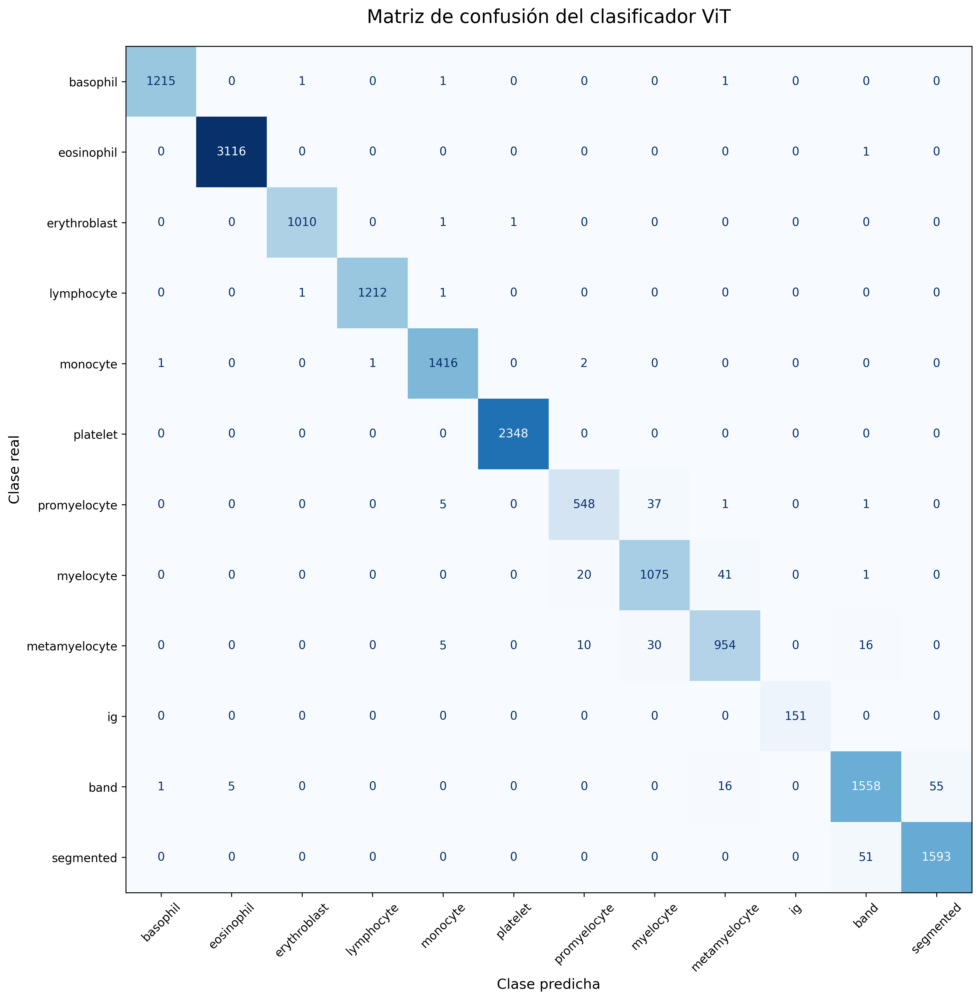

# TFM Diana — Análisis Multimodal de Células Sanguíneas

Este proyecto aborda el problema de la **descripción morfológica automática en hematología**, combinando clasificación visual y generación de lenguaje clínico estructurado.

---

# Pipeline multimodal

El sistema integra múltiples etapas:

- **ViT** → clasificación celular
- **BLIP base** → captions iniciales
- **BLIP v1 / v2 / v3** → fine-tuning progresivo
- **BLIP + LoRA** → control estructural y precisión
- **Postprocesado morfológico** → normalización clínica
- **Gemma 3 / 4 y Qwen3-VL** → refinamiento multimodal
- **Gemini 3** → auditoría semántica automática

---

# Resultados principales

### Clasificación (ViT)

- Accuracy: **98.50%**
- F1 weighted: **0.985**
- Dataset: **17.092 imágenes / 13 clases**

---

### Evaluación global modelos

| Modelo | Correcto ampliado | Utilidad clínica | Accuracy atributos |
|---|---|---|---|
| BLIP+LoRA base | 35.71 | 31.11 | 69.34 |
| BLIP+LoRA conservador | **83.80** | **80.95** | **86.11** |
| Gemma 3 4B | 94.04 | 69.28 | 86.01 |
| Qwen3-VL | **99.74** | 74.72 | 48.86 |

Conclusión:
- **BLIP+LoRA conservador = mejor equilibrio clínico**
- **Gemma = mejor riqueza semántica**
- **Qwen = más cobertura pero menos precisión morfológica**

Estos resultados evidencian que no existe un modelo único óptimo, sino que diferentes enfoques capturan distintas dimensiones del problema (estructura vs semántica).
---

### Precisión por atributos

| Atributo | BLIP LoRA | Gemma | Qwen |
|---|---|---|---|
| Tamaño | 96.0 | 92.0 | 6.0 |
| Cromatina | **97.6** | 93.0 | 50.6 |
| Citoplasma | 82.7 | 87.1 | 47.3 |
| Granulación | 51.7 | **87.3** | 32.4 |

---

### Visualización

<p align="center">
  
</p>

<p align="center">
  
</p>

El heatmap muestra que la precisión global puede ocultar diferencias relevantes a nivel de atributos, especialmente en características como la granulación o la cromatina.

---

## Limitaciones

- Los modelos presentan errores en atributos morfológicos finos (granulación, cromatina, segmentación nuclear)
- Las métricas globales no capturan completamente la calidad clínica de las descripciones
- Existe variabilidad entre modelos en la representación estructural de atributos


---


# Estructura completa del repositorio

```text
blood-cell-vllm/
├── codigo/
│   └── codigo_pulido.ipynb
│
├── modelo/
│   ├── vit_subclasses_final/
│   ├── blip_finetuned_hybrid_Diana_v1_final/
│   ├── blip_finetuned_hybrid_Diana_v2_final/
│   ├── blip_finetuned_hybrid_Diana_v3_refiner_kb_final/
│   └── checkpoints/
│
├── modelos/
│   ├── blip_lora/
│   │   ├── blip_lora_libre_base/
│   │   ├── blip_lora_libre_final/
│   │   ├── blip_lora_mejorado_conservador/
│   │   └── blip_lora_refiner_kb_canonico/
│   │
│   ├── gemma/
│   │   ├── gemma3_vlm_condicionada/
│   │   └── outputs/
│   │
│   ├── qwen/
│   │   ├── qwen3vl_finetuned/
│   │   └── fireworks/
│   │
│   └── gemini/
│       └── evaluacion_semantica/
│
├── datos/
│   ├── dataset_base_vit_blip.csv
│   ├── dataset_blip_v1.csv
│   ├── dataset_blip_v2.csv
│   ├── dataset_final_reconstruido.csv
│   ├── dataset_blip_lora_refiner_kb_full.csv
│   │
│   ├── spec_morphology/
│   │   ├── morphology_kb.yaml
│   │   ├── vocab_normalization.yaml
│   │   └── prototipos_morfologicos/
│   │
│   └── analisis/
│       │
│       ├──  resultados_globales/
│       │   ├── tabla_final_4_modelos_global.csv
│       │   ├── tabla_final_4_modelos_atributos.csv
│       │   ├── deltas_final_4_modelos.csv
│       │   └── tabla_final_unificada_metricas_canonicas.csv
│       │
│       ├──  evaluacion_blip/
│       │   ├── blip_eval_validacion_blip_v1.csv
│       │   ├── blip_eval_validacion_blip_v2.csv
│       │   ├── blip_eval_validacion_blip_v3_refiner_kb.csv
│       │   └── comparativa_blip_base_v1_v2_v3_refiner_kb.csv
│       │
│       ├──  evaluacion_gemini/
│       │   ├── auditoria_gemini_*.csv
│       │   ├── comparativa_blip_v2_anotada_gemini_multimodal_kb.csv
│       │   └── tabla_errores_blip_v2_v3_refiner_kb_multimodal_limpia.csv
│       │
│       ├──  modelos_multimodales/
│       │   ├── gemma3_vlm_condicionada_*.csv
│       │   ├── predicciones_qwen3vl_*.csv
│       │   ├── resumen_clinico_gemma3_*.csv
│       │   └── resumen_clinico_qwen3vl_*.csv
│       │
│       ├──  atributos_morfologicos/
│       │   ├── atributos_blip_conservador.csv
│       │   ├── atributos_gemma3_vlm_*.csv
│       │   ├── atributos_qwen3vl_*.csv
│       │   └── tabla_atributos_*.csv
│       │
│       ├──  metricas/
│       │   ├── metricas_blip_*.csv
│       │   ├── metricas_classification_report.csv
│       │   └── resumen_metricas_*.csv
│       │
│       ├──  figuras/
│       │   ├── matriz_confusion_vit.png
│       │   ├── figura_final_blip_base_vs_blip_conservador_vs_qwen.png
│       │   ├── figura_final_blip_reforzado_gemma_qwen.png
│       │   └── graficos_final_4_modelos/
│       │
│       └──  predicciones/
│           ├── predicciones_blip_lora_*.csv
│           ├── predicciones_qwen3vl_*.csv
│           └── predicciones_gemma3_*.csv
│
├── imagenes/
│   ├── basophil/
│   ├── eosinophil/
│   ├── erythroblast/
│   ├── ig/
│   ├── lymphocyte/
│   ├── monocyte/
│   ├── neutrophil/
│   └── platelet/
│
├── outputs_finales/
│   ├── vit/
│   ├── blip_v1/
│   ├── blip_v2/
│   ├── blip_v3/
│   ├── blip_lora/
│   ├── gemma_3/
│   ├── gemma_4/
│   ├── qwen/
│   └── recursos_comunes/
│
├── memoria/
│   └── TFM_Diana.docx
│
└── bibliografia/
```

---

# Pipeline

```text
Imágenes de microscopio
        │
        ▼
  ViT + BLIP base      ──►  generación del dataset base
        │
        ▼
  Vocabulario experto + prototipos del patólogo
        │
        ▼
  Dataset multimodal refinado
        │
        ▼
  Fine-tuning BLIP v1
        │
        ▼
  Fine-tuning BLIP v2
        │
        ▼
  BLIP + LoRA (ajuste ligero)
        │
        ▼
  Postprocesado conservador / estructurado
        │
        ▼
  Refinamiento con VLMs (Gemma 3 / Gemma 4 / Qwen3-VL)
        │
        ▼
  Evaluación semántica automática (Gemini 3)
        │
        ▼
  Dataset final multimodal validado
        │
        ▼
  Organización automática → outputs_finales

```

---

## Organización final del pipeline

El pipeline incorpora una etapa final de organización automática de todos los resultados generados, estructurados en la carpeta `outputs_finales`. Esta organización se realiza de forma sistemática por modelo (ViT, BLIP, BLIP+LoRA, Gemma y Qwen3-VL), permitiendo separar claramente cada fase experimental.

Para cada modelo, se agrupan los siguientes artefactos:

- **Modelos y checkpoints** generados durante el entrenamiento
- **Datasets intermedios y finales** utilizados en cada etapa del pipeline
- **Predicciones generadas** (captions y clasificaciones)
- **Métricas de evaluación** tanto cuantitativas como semánticas
- **Figuras y visualizaciones**, incluyendo matrices de confusión y comparativas entre modelos
- **Logs de ejecución**, útiles para depuración y trazabilidad experimental
- **Archivos de configuración** (YAML, JSON, CSV), que documentan parámetros y transformaciones aplicadas

Esta organización permite:

- Garantizar la **reproducibilidad completa** del pipeline
- Facilitar la **trazabilidad de los experimentos**
- Permitir una **comparación estructurada entre modelos**
- Simplificar la **validación y revisión de resultados**

En conjunto, esta estructura convierte el pipeline en un sistema modular, escalable y reutilizable para futuros estudios en hematología digital.

---


## Subclases celulares

El modelo clasifica **12 tipos celulares**, incluyendo tanto clases específicas como una categoría agregada para granulocitos inmaduros.

En particular, la clase `ig` (immature granulocyte) agrupa distintos estadios de maduración de la serie mieloide, que también se consideran de forma individual como subclases independientes.

| Clase | Descripción |
|---|---|
| `basophil` | Basófilo |
| `eosinophil` | Eosinófilo |
| `erythroblast` | Eritroblasto |
| `ig` | Granulocito inmaduro (categoría agregada) |
| `lymphocyte` | Linfocito |
| `monocyte` | Monocito |
| `band` | Neutrófilo en banda |
| `platelet` | Plaqueta |
| `myelocyte` | Mielocito (subclase de IG) |
| `metamyelocyte` | Metamielocito (subclase de IG) |
| `promyelocyte` | Promielocito (subclase de IG) |
| `segmented` | Neutrófilo segmentado |

---

## Tecnologías

| Componente | Tecnología |
|---|---|
| Clasificación de imagen | [ViT-base-patch16-224](https://huggingface.co/google/vit-base-patch16-224) (fine-tuned) |
| Captioning visual | [BLIP-image-captioning-base](https://huggingface.co/Salesforce/blip-image-captioning-base) |
| Fine-tuning de captions | BLIP fine-tuned v1 + BLIP fine-tuned v2 |
| Ajuste eficiente | BLIP + LoRA (Low-Rank Adaptation) |
| Refinamiento textual | Gemma 3 / Gemma 4 (VLM condicionado) |
| Modelo multimodal adicional | Qwen3-VL fine-tuned |
| Evaluación semántica | Gemini 3 Flash Preview |
| Framework | PyTorch + HuggingFace Transformers |
| Métricas | scikit-learn, evaluate |
| Entrenamiento | Google Colab (Tesla T4) |
| Formato de pesos | SafeTensors |

Además, se evaluaron modelos multimodales adicionales (Gemma 3 y Qwen3-VL) para analizar su capacidad de refinamiento textual y su impacto en la calidad clínica de las descripciones.

---

## Uso del notebook

El notebook `codigo/codigo_pulido.ipynb` está organizado en secciones numeradas y es autocontenido. Las rutas son relativas a la raíz del repositorio, por lo que no requiere configuración adicional si se mantiene la estructura original de carpetas.

### Requisitos

```bash
pip install transformers datasets accelerate evaluate torchvision pillow openpyxl scikit-learn pandas matplotlib safetensors jupyter tqdm seaborn

```
## 📚 Secciones principales del notebook

| # | Fase | Bloques | Descripción |
|---|---|---|---|
| 1 | Configuración inicial | Bloques 1–10 | Montaje de Google Drive, definición de `BASE_DIR`, instalación de dependencias y comprobación de GPU |
| 2 | Preparación del dataset | Bloques 11–30 | Carga de imágenes, reconstrucción del dataset, división train/val/test y análisis de distribución de clases |
| 3 | Clasificación visual | Bloques 31–50 | Entrenamiento, validación e inferencia del modelo ViT para clasificación de subclases celulares |
| 4 | Validación estructural | Bloques 51–60 | Cálculo de métricas de clasificación, matriz de confusión y análisis de errores |
| 5 | Generación inicial de captions | Bloques 61–65 | Uso de BLIP base para generar descripciones automáticas |
| 6 | Normalización y conocimiento experto | Bloques 66–75 | Limpieza textual, vocabulario controlado y reglas morfológicas |
| 7 | BLIP fine-tuned | Bloques 76–90 | Entrenamiento y evaluación de BLIP v1, v2 y v3/refiner KB |
| 8 | Experimento canónico | Bloques 91–95 | Generación estructurada basada en atributos morfológicos |
| 9 | Experimento libre | Bloques 96–105 | BLIP+LoRA libre con prior morfológico |
| 10 | BLIP+LoRA conservador | Bloques 106–112 | Postprocesado y evaluación clínica |
| 11 | Evaluación con Gemini | Bloques 113–118 | Auditoría semántica automática |
| 12 | Refinamiento con Gemma | Bloques 119–122 | Evaluación de Gemma como refinador multimodal |
| 13 | Evaluación con Qwen3-VL | Bloques 123–126 | Evaluación del modelo multimodal de referencia |
| 14 | Comparativa final | Bloques 90–126 (transversal) | Tablas globales, métricas y figuras comparativas |
| 15 | Organización final | Bloques 120–126 (transversal) | Guardado de outputs y datasets finales |
| 16 | Exportación | Bloques finales | Preparación para memoria, GitHub y Hugging Face |

> **Nota:** El entrenamiento (`fp16`) se activa automáticamente solo si hay GPU disponible. Sin GPU, el notebook puede ejecutarse para inferencia y análisis con el modelo ya entrenado en `modelo/`.

---

## Archivos de salida generados

Al ejecutar el pipeline completo se generan múltiples artefactos organizados en la carpeta `datos/`.

### Datasets generados

- `dataset_base_vit_blip.csv` — dataset base generado con ViT + BLIP
- `dataset_blip_v1.csv` — captions tras el primer fine-tuning de BLIP
- `dataset_blip_v2.csv` — captions tras el segundo fine-tuning de BLIP
- `dataset_blip_lora_refiner_kb_full.csv` — dataset tras refinamiento con BLIP+LoRA
- `dataset_completo_inferencia_blip_lora_libre.csv` — inferencias completas en modo libre
- `dataset_completo_inferencia_blip_lora_libre_base_mejorada.csv` — versión mejorada con prior morfológico
- `dataset_final_reconstruido.csv` — dataset final consolidado
- `dataset_final_VIT_BLIP_patologo_Diana.csv` — dataset final validado con conocimiento experto

---

### Clasificación (ViT)

- `classification_report_vit.csv`
- `classification_errors_vit.csv`
- `confusion_matrix_vit.csv`
- `matriz_confusion_vit.png`
- `frequent_confusions_vit.csv`

---

### Generación de captions (BLIP y LoRA)

- `predicciones_blip_lora_libre_dataset_completo.csv`
- `predicciones_blip_lora_libre_base_mejorada_dataset_completo.csv`
- `predicciones_blip_lora_libre_dataset_completo_limpias.csv`
- `predicciones_blip_lora_refiner_kb_full_canonico.csv`
- `blip_eval_validacion_blip_v1.csv`
- `blip_eval_validacion_blip_v2.csv`
- `blip_eval_validacion_blip_v3_refiner_kb.csv`
- `comparativa_blip_base_v1_v2_v3_refiner_kb.csv`

---

### Modelos multimodales (Gemma y Qwen)

- `gemma3_vlm_condicionada_generada_FULL.csv`
- `gemma3_vlm_condicionada_anotada_gemini_multimodal_ESTRICTO_FULL_LIMPIO.csv`
- `predicciones_qwen3vl_finetuned_dataset_completo.csv`
- `qwen3vl_finetuned_dataset_completo_ESTRICTO.csv`
- `resumen_clinico_gemma3_*.csv`
- `resumen_clinico_qwen3vl_*.csv`

---

### Evaluación semántica (Gemini 3)

- `auditoria_gemini3_flash_dataset_completo_blip_lora_libre_base_mejorada.csv`
- `auditoria_gemini_atributos_todos_modelos_canonico.csv`
- `comparativa_blip_v2_anotada_gemini_multimodal_kb.csv`
- `tabla_errores_blip_v2_v3_refiner_kb_multimodal_limpia.csv`

---

### Análisis por atributos morfológicos

- `tabla_final_4_modelos_atributos.csv`
- `tabla_atributos_blip_conservador.csv`
- `tabla_atributos_gemma3_vlm_condicionada_ESTRICTO_FULL.csv`
- `tabla_atributos_qwen3vl_ESTRICTO.csv`

---

### Comparativas globales

- `tabla_final_4_modelos_global.csv`
- `tabla_final_blip_conservador_vs_qwen.csv`
- `deltas_final_4_modelos.csv`
- `deltas_final_blip_reforzado_gemma_qwen.csv`

---

### Figuras generadas

- `figura_final_blip_base_vs_blip_conservador_vs_qwen.png`
- `figura_final_blip_reforzado_gemma_qwen.png`
- `figura_final_blip_lora_vs_qwen3vl_finetuned.png`
- `graficos_final_4_modelos/`

---

En conjunto, estos artefactos permiten:

- Analizar el rendimiento del modelo de clasificación
- Evaluar la calidad semántica de las descripciones generadas
- Comparar distintos enfoques multimodales (BLIP+LoRA, Gemma, Qwen)
- Validar atributos morfológicos de forma estructurada
- Garantizar la trazabilidad y reproducibilidad completa del pipeline

---

## Carpeta `datos/analisis`

La carpeta `datos/analisis` contiene todos los resultados intermedios y finales generados durante el pipeline, incluyendo métricas, predicciones, auditorías semánticas y comparativas entre modelos.

Debido al gran volumen de archivos generados (>140), estos se agrupan en varias categorías principales:

### Resultados globales
- `tabla_final_4_modelos_global.csv`
- `tabla_final_4_modelos_atributos.csv`
- `deltas_final_4_modelos.csv`

### Evaluación de modelos BLIP
- `blip_eval_validacion_blip_v1.csv`
- `blip_eval_validacion_blip_v2.csv`
- `blip_eval_validacion_blip_v3_refiner_kb.csv`

### Auditoría semántica (Gemini)
- `auditoria_gemini_*.csv`
- `comparativa_blip_v2_anotada_gemini_multimodal_kb.csv`

### Modelos multimodales
- `gemma3_vlm_condicionada_*.csv`
- `predicciones_qwen3vl_*.csv`

### Análisis por atributos
- `tabla_atributos_*.csv`
- `atributos_blip_conservador.csv`

### Métricas y resúmenes
- `metricas_*.csv`
- `resumen_*.csv`

### Figuras
- `figura_final_*.png`
- `graficos_final_4_modelos/`

---

> Nota: La estructura de esta carpeta refleja el flujo completo del pipeline, desde la generación de captions hasta la evaluación multimodal y la comparación entre modelos.
